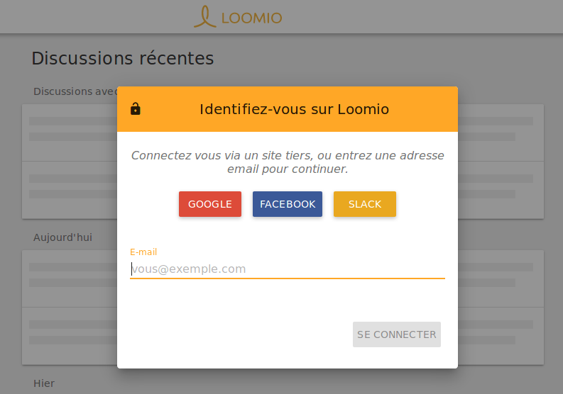

# Premiers pas

Voici quelques informations sur les différentes façons de démarrer sur Loomio&nbsp;:

## Créer un nouveau groupe depuis la page d‎‎’accueil

Vous pouvez créer un nouveau groupe depuis la page d‎‎’accueil de Loomio en cliquant sur le bouton [**Créer un nouveau groupe**](https://www.loomio.org/g/new). Saisissez votre nom, une adresse électronique et le nom du groupe dans le formulaire. Vous recevrez par courriel un lien qui vous conduira vers le nouveau groupe que vous venez de créer.

## Vous êtes invité dans un groupe Loomio

Lorsque vous recevez une invitation à rejoindre un groupe Loomio existant, vous recevez un lien d’invitation unique par courriel.

Si c’est votre première utilisation de Loomio, il vous sera demandé de créer un compte. Si vous possédez déjà un compte, vous rejoindrez directement ce groupe une fois authentifié.

## Authentification unique

Loomio permet de vous enregistrer avec Facebook, Google ou Slack. Si vous n’avez pas de compte Loomio, vous pouvez vous enregistrer en utilisant l’un de ces services tiers en cliquant sur le bouton correspondant sur la [page de **connexion**](https://www.loomio.org/users/sign_in/). Si vous êtes déjà authentifié sur Google, Facebook, ou Slack, nous lierons cette méthode d’authentification à votre compte Loomio. Sinon, il vous sera demandé de vous y authentifier. Une fois que Loomio reconnaît votre compte tiers existant, suivez le dialogue pour créer votre compte Loomio.

Vous pouvez aussi associer votre compte Google, Facebook, Slack à un compte Loomio existant. Assurez-vous d’être déconnecté, visitez [la page de **connexion**](https://www.loomio.org/users/sign_in) et choisissez votre plateforme préféréee. Loomio vous demandera si vous souhaitez créer un nouveau compte avec votre compte existant sur la plateforme, ou le lier à un compte Loomio existant.

### Information aux utilisateurs de Persona ###

Loomio permettait l'authentification avec Mozilla Persona. Cependant, Persona s'est arrếté [shut down](http://www.pcworld.com/article/3021736/internet/mozilla-persona-login-system-to-shut-down-end-november.html "Article about the end of Mozilla Persona - Opens in new tab") donc nous avons retiré cette option de Loomio. Pour vous connecter avec votre compte lié à Persona, [réinitialisez votre mot de passe](https://www.loomio.org/users/password/new "S'ouvre dans une nouvelle page") et indiquez l'adresse e-mail que vous utilisiez avec votre compte Persona.
