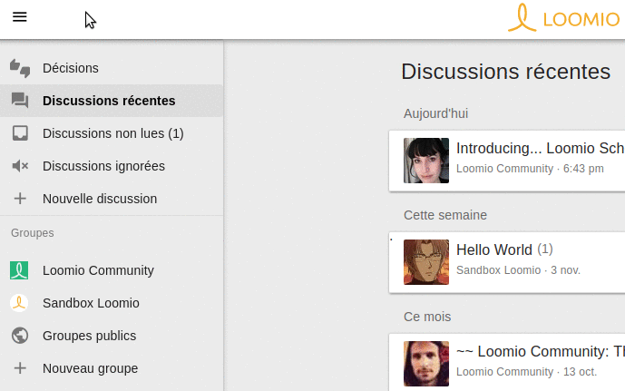
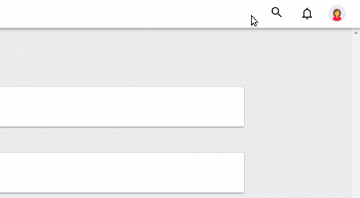

# Naviguer sur Loomio

Vous trouverez vos discussions et vos groupes dans la barre latérale, qui s'affiche par défaut sur les grands écrans, et peut être affichée ou cachées en appuyant sur le bouton « menu » de la barre de navigation. Celle-ci contient aussi le champ de recherche, la zone de notifications et votre menu d'utilisateur.

## Naviguer dans vos discussions et vos groupes

### Discussions récentes

**Discussions récentes** est votre page d‎‎’accueil quand vous vous connectez à Loomio. Elle vous donne un aperçu des activités les plus récentes dans vos groupes. Celles-ci sont présentées selon leur priorité: les décisions ouvertes sont en haut, suivies par toutes les autres discussions de votre groupe, classées par activité la plus récente&nbsp;: **Aujourd‎‎’hui**, **Hier**, **Ce mois-ci**, **Plus d‎‎’un mois**.

Si une discussion ou une décision est affichée **en gras**, alors il y a eu de l‎‎’activité depuis votre dernière visite. Les nombres entre parenthèses après les titres indiquent combien de nouveaux commentaires ou votes ont été postés depuis votre dernière visite. Les propositions afficheront un camembert, les autres types de sondages ou de votes un histogramme des voix, avec votre position en surimpression sur le diagramme. Si vous n‎‎’avez pas pris position, un point d‎‎’exclamation attirera votre attention.

### Discussions non lues

Cette page montre toutes les discussions et décisions dans lesquels du contenu a été ajouté depuis votre dernière visite, classés par groupe. Vous pouvez cliquer sur **Marquer comme lu** sur l‎‎’aperçu d‎‎’un fil pour l‎‎’enlever de cette page sans aller voir le fil. Vous pouvez aussi [Marquer comme lu](keeping_up_to_date.html#thread-volume) les notifications d‎‎’une discussion ici.

### Discussions ignorées

Cette page affiche toutes les discussions que vous avez précédemment **ignorées**. Celles-ci n'apparaissent pas dans vos discussions récentes ou non lues. Vous pouvez Ignorer une discussion en la survolant plus un cliquant sur le bouton Ignorer, que cela soit sur la page du groupe ou sur dans vos discussions récentes ou non lues.

### Voir vos groupes

Tous les (sous-)groupes auxquels vous appartenez sont listés dans la barre latérale. Si vous n'appartenez qu'à un groupe, la page de ce groupe sera votre parge d'accueil à la connexion à Loomio. Si vous êtes membre de plusieurs groupes, vous pourrez facilement passer de l'un à l'autre.

### Parcourir les groupes publics

Vous pouvez parcourir et demander à rejoindre les groupes privés depuis la page **Groupes publics**, accessibles depuis la barre latérale.

## Rechercher du contenu, accéder à vos notifications et à votre menu utilisateur

### Recherche de discussions

Le champ de recherche apparaît lorsque vous cliquez sur l'icône Loupe du bandeau de navigation supérieur. Les résultats afficheront les fils de discussion contenant le(s) mot-clé(s) dans le contexte, les commentaires ou les décisions.

### Accédez à vos notifications

Selon vos préférences, vous [recevrez ou non des courriels de notification](keeping_up_to_date.html), mais toutes les activités que vous devez suivre seront affichées quand vous cliquez sur le bouton Alarme.

### Accéder à et modifier votre profil, vos préférences, l'aide utilisateur et la déconnexion

Vous pouvez voir et modifier votre profil utilisateur via le menu **Modifier mon profil**. Consultez l'aide concernant le [profil utilisateur](your_user_profile.html "goes to user profile section of the help manual") pour plus d'informations.

Vous pouvez voir et modifier vos préférences de notification par courriel via le menu **Paramètres e-mail**. Pour en savoir plus, référez-vous à la page [Se tenir à jour](keeping_up_to_date.html "goes to keeping up to date section of the help manual").

Vous trouverez également un lien vers les ressources d'aide, comme ce guide utilisateur.

Vous pouvez vous déconnecter de Loomio, surtout si vous n'utilisez pas votre ordinateur ou votre téléphone personnel(s) pour y accéder.
